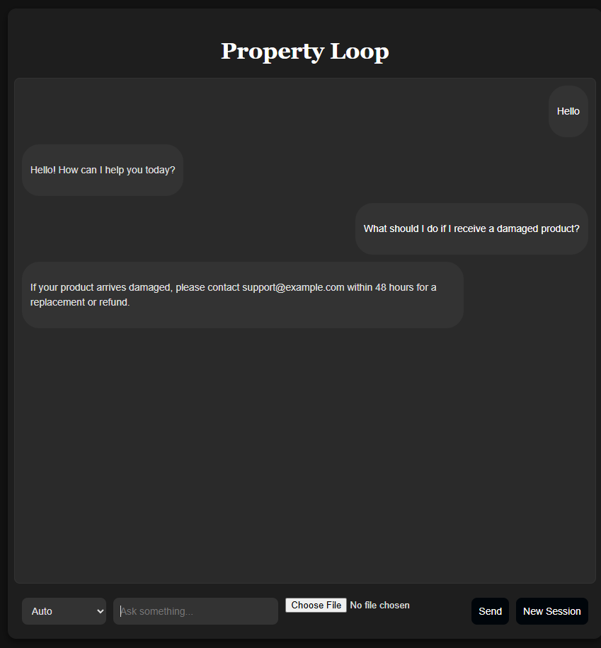

# PropertyLoop

PropertyLoop is a real estate chatbot application designed to assist users with tenancy-related queries, property issue detection, and troubleshooting. It features a frontend built with React and TypeScript, and a backend powered by FastAPI and Google Generative AI models.

---

## Documentation

### Tools and Technologies Used

#### Frontend:
- **React**: For building the user interface.
- **TypeScript**: For type-safe development.
- **Vite**: For fast development and build tooling.
- **React Router**: For client-side routing.
- **Axios**: For making HTTP requests to the backend.
- **CSS**: For styling the application.

#### Backend:
- **FastAPI**: For building the RESTful API.
- **Pydantic**: For data validation and serialization.
- **Uvicorn**: For running the FastAPI server.
- **Google Generative AI (Gemini)**: For natural language processing and image-based issue detection.
- **Pillow**: For image processing.
- **LangChain**: For managing conversational agents.

#### Other Tools:
- **dotenv**: For managing environment variables.
- **uuid**: For generating unique session IDs.
- **ESLint**: For linting and maintaining code quality.

---

### Logic Behind Agent Switching

The backend uses a **Router Agent** to determine which specialized agent should handle a user's query. The logic is as follows:
1. **Routing Decision**: Based on the user's input (text, image, or both) and the conversation history, the Router Agent decides whether to route the query to:
   - The **FAQ Agent**: Handles tenancy-related questions using a predefined FAQ dataset.
   - The **Vision Agent**: Processes image-based queries for property issue detection.
2. **Fallback**: If the Router Agent cannot confidently decide, it returns an "unsure" response, prompting the user to clarify their query.

The routing decision is powered by a prompt-based LLM (Large Language Model) that evaluates the context and content of the query.

---

### How Image-Based Issue Detection Works

The **Vision Agent** processes image-based queries as follows:
1. **Image Decoding**: The frontend sends a base64-encoded image to the backend. The Vision Agent decodes this image using the `Pillow` library.
2. **Contextual Analysis**: The agent combines the image data with any accompanying text and the conversation history to generate a comprehensive prompt.
3. **AI Processing**: The prompt is sent to the Google Generative AI model (Gemini), which analyzes the image and text to:
   - Detect visible property issues (e.g., water damage, mold, cracks).
   - Provide troubleshooting suggestions (e.g., "Contact a plumber for this issue").
   - Ask clarifying questions if the issue is unclear.
4. **Response**: The agent returns a detailed response to the user.

---

### Use Case Examples

#### 1. Mold Detection

**User Input**: Uploads an image of a moldy wall and asks, "Can you describe the issue?"  
**Agent**: Vision Agent  
**Response**:  
"The image shows significant mold growth on the walls, likely due to moisture. The paint is also peeling in areas. This suggests a serious moisture problem. Troubleshooting suggestions:  
- **Identify the source of the moisture**: Is there a leak? Poor ventilation? Condensation?  
- **Address the moisture source**: Fix any leaks, improve ventilation, or use a dehumidifier. You might need to contact a plumber or other specialist.  
- **Remove the mold**: Use a mold-killing cleaner and follow the instructions carefully. For extensive mold growth like this, professional remediation is highly recommended.  
- **Repair the walls**: Once the mold is removed and the moisture issue is resolved, you can repair the damaged paint and drywall. Consider using an anti-damp coating to prevent future problems.  
Given the extent of the mold, I strongly recommend consulting with a professional mold remediation company. They can properly assess the situation and ensure the mold is safely and effectively removed."

---

#### 2. FAQ Query

**User Input**: "What should I do if I receive a damaged product?"  
**Agent**: FAQ Agent  
**Response**:  
"If your product arrives damaged, please contact support@example.com within 48 hours for a replacement or refund."

---

This project demonstrates the integration of advanced AI capabilities with a user-friendly interface to provide a seamless experience for real estate-related queries and troubleshooting.

